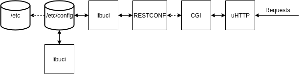

# OpenWrt RESTCONF

This is a prototype implementation of RESTCONF for the OpenWrt system that utilizes the UCI configuration files as a
datastore.

## Requirements

1. The OpenWrt Buildroot has to be installed on the system ([Tutorial](https://openwrt.org/docs/guide-developer/build-system/use-buildsystem))
2. Two environment variables have to be set. An example of them can be seen in `.env.example`.
3. Python 3 for the YANG conversion script
4. Tool for converting YANG to YIN

## Adding YANG modules

To add YANG modules for OpenWrt they have to go through some pre-processing. This is
what the `./yin2json/yin2json.py` script does.

### Annotations

Before YANG modules can be used with this implementation they have to be
annotated with the extensions provided in `/yang/openwrt-uci-extension.yang`.
An example of an annotated module is `/yang/restconf-example.yang`

### Script

1. Convert the YANG modules to be included to YIN and put them in one folder, i.e. `/yin`.
   For example with [`pyang`](https://github.com/mbj4668/pyang)
   ```console
   pyang -f yin ./yang/restconf-example.yang -p ./yang -o ./yin/restconf-example.yin 
   ```
2. Run the `main.py` script
   ```console
   python3 ./yin2json/yin2json.py -y ./yin -o ./generated ./yin/restconf-example.yin ...
   ```
   This converts the YIN files and generates a `.h` file in `./generated` that has to be included in `/src/generated/yang.h`

## Building

1. Create a new directory `mkdir build`
2. Change into the directory `cd build`
3. Run cmake `cmake ..`
4. Run make `make`

After this a `restconf` binary will have compiled that can then be used as a CGI
script on OpenWrt

## Architecture



The binary that is compiled is a CGI script that can be used with any
CGI enabled web server but on OpenWrt the uHTTP server is recommended.

To utilize the script with the uHTTP server the following steps have to
be followed:

1. Install uHTTP with
   ```console
   opkg update
   opkg install uhttpd
   ```
2. Configure uHTTPd ([Documentation](https://openwrt.org/docs/guide-user/services/webserver/uhttpd))
3. Make sure the `http_keepalive` option in `/etc/config/uhttpd` is set to `0`
4. Copy the script into the `/www/cgi-bin/` folder
5. Now you should be able to make requests at the `<IP>/cgi-bin/restconf` URL

## Testing

The tests are inside the `/test` directory and are based on the Python
[Tavern Testing Framework](https://github.com/taverntesting/tavern). After
installing the framework the tests can be run using either of the
following commands:

```console
tavern-ci ./test/test_restconf.tavern.yml
# or
py.test ./test/test_restconf.tavern.yml
```

This will run integration tests that check the actual implementation. The
url where the server is located can be changed in `/test/common.yaml`.